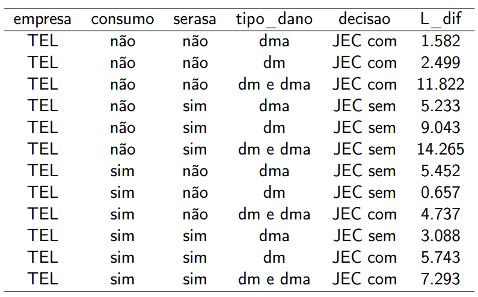

## Julio Trecenti

Diretor-técnico da Associação Brasileira de Jurimetria (ABJ).


## Julio Trecenti

Bacharel, mestre e doutorando em estatística.


## Julio Trecenti

Sócio da Platipus - Inteligência jurídica e Analytics.


## Julio Trecenti

Vice-presidente do Conselho Regional de Estatística - 3ª região.


# Estatística

## O que faz um estatístico?

> - Gráficos e tabelas
> - Conta mentiras com números
> - Tortura os dados até eles fornecerem informação

## Resposta


Bruxaria! :D

## Na verdade está mais pra isso


## Alguns estatísticos famosos


## Alguns estatísticos famosos


## Alguns estatísticos famosos


## Diferenças entre bruxos e estatísticos

> - O estatístico utiliza **dados** para aprender sobre um fenômeno.
> - O estatístico assume que está errado.
> - Assim, é capaz de **medir** o erro cometido e controlar a incerteza.

# Jurimetria

## Jurimetria: conceito

- É a estatística aplicada ao Direito.

- Princípios mais importantes: 
    - Concretude
    - Incerteza

## Jurimetria: esferas

### **Processo como objeto**  

   - Perda de uma chance  
   - Lucros cessantes  
   - Investigação de paternidade

## Jurimetria: esferas

### **Tema ou entidade como objeto**  
   - Perfil de processos sobre direito do consumidor  
   - Decisão ótima sobre tentativas de acordo  
   - Probabilidade de decisões favoráveis ao contribuinte no CARF.

## Jurimetria: esferas

### **Sociedade como objeto** 

   - Processo de adoção no Brasil  
   - Alocação ótima de varas  
   - Processamento de homicídio 
   - Perfil de pessoas desaparecidas no estado de São Paulo

# Modelo preditivo

## Modelo preditivo: o que é

> - Modelo é uma simplificação da realidade.
> - "Todos os modelos estão errados. Mas alguns são úteis".
> - Exemplo: aceleração da gravidade.
> - Exemplo: dados não viciados.

## Modelo preditivo: para que serve

Modelos preditivos fornecem a informação básica para qualquer tomada de decisão estratégica.

### Advogado:

- Cobrança de honorários proporcional à probabilidade de vitória e tempo esperado.
- Levantamento de jurisprudência vencedora.

## Modelo preditivo: para que serve

### Juiz:

- Previsão do estoque de processos da vara.
- Estatísticas sobre valores de indenização para casos similares.

### Corregedoria:

- Identificação de ocorrências anômalas.
- Produtividade de varas e magistrados.

## Modelo preditivo: para que serve

### Empresa:

- Provisionamento de carteira de ações.
- Estratégias de acordo em processos trabalhistas.

## Modelo preditivo: para que serve

### Cidadão:

- Decisão ótima para litigar.
- Listagem de advogados com maior probabilidade de êxito para a causa.
- Peticionamento automático.

## Modelo preditivo: como criar

- $y$ resposta que queremos predizer. Por exemplo: resultado da ação ou tempo da ação.
- $X$ variáveis que podem estar associadas à resposta. Por exemplo: valor da causa, juiz, palavras utilizadas na petição inicial etc.

**Objetivo**: criar uma função $g$ tal que

$$
y \approx g(X)
$$

## Modelo trivial: exemplo das câmaras

```{r echo=FALSE, warning=FALSE, message=FALSE}
library(tidyverse)
library(stringr)
library(lubridate)
data(d_final, package = 'tjspCrim')
p <- d_final %>%
  mutate(n_processo = str_replace_all(n_processo, '[^0-9]', '')) %>% 
  # inner_join(decisoes, 'n_processo') %>% 
  count(orgao_julgador, decisao) %>%
  mutate(ntot = sum(n), prop = n / ntot) %>%
  ungroup() %>%
  filter(ntot > 10) %>% 
  mutate(num = readr::parse_number(orgao_julgador),
         num = sprintf('%02d', num)) %>% 
  mutate(extra = str_detect(orgao_julgador, 'Extra'),
         extra = ifelse(extra, 'Câmara Extraordinária', 
                        'Câmara de Direito Criminal')) %>% 
  filter(extra == 'Câmara de Direito Criminal') %>% 
  arrange(decisao) %>% 
  mutate(decisao = forcats::fct_rev(decisao)) %>% 
  mutate(num = forcats::fct_reorder(num, prop, fun = first, .desc = TRUE)) %>%
  ggplot(aes(x = num, fill = decisao, y = prop)) +
  geom_bar(stat = 'identity', colour = 'black', position = 'stack') +
  # facet_wrap(~extra, scales = 'free_x', ncol = 1) +
  theme_bw() +
  scale_y_continuous(labels = scales::percent) +
  scale_fill_brewer(palette = 'Reds') +
  xlab('Órgão julgador') +
  ylab('Proporção de processos por tipo de decisão') +
  theme(legend.position = "bottom")
plotly::ggplotly(p)

```

## Problema

- Geralmente é possível pensar uma função que se ajusta muito bem aos meus dados.

## Sobreajuste

```{r echo=FALSE, warning=FALSE, message=FALSE}
set.seed(3)
x <- c(seq(1, 7, .5), 8)
y <- 1 + 3 * x + x^2 + rnorm(length(x), 0, 10)
new <- c(rep('bd', 13), 'novo')
xx <- 2.5
library(ggplot2)
p <- ggplot(data.frame(x, y), aes(x, y)) +
  geom_point(size = 3) +
  geom_point(x = xx, y = 1 + 3*xx + xx^2, colour = 'red', size = 3)
plotly::ggplotly(p)
```

## Sobreajuste

```{r echo=FALSE, warning=FALSE, message=FALSE}
p <- ggplot(data.frame(x, y), aes(x, y)) +
  geom_point(size = 3) +
  geom_point(x = xx, y = 1 + 3*xx + xx^2, colour = 'red', size = 3) +
  geom_smooth(se = FALSE, span = .2)
plotly::ggplotly(p)
```

## Sobreajuste

```{r echo=FALSE, warning=FALSE, message=FALSE}
p <- ggplot(data.frame(x, y), aes(x, y)) +
  geom_point(size = 3) +
  geom_point(x = xx, y = 1 + 3*xx + xx^2, colour = 'red', size = 3) +
  geom_smooth(se = FALSE, span = 1.2, colour = 2)
plotly::ggplotly(p)
```

## Data spliting

- Separe sua base de dados aleatoriamente em dois conjuntos: base de treino e base de teste.
- Ajuste um modelo usando a base de treino.
- Teste a qualidade do modelo na base de teste.

Repetir esses passos até ficar satisfeito com o resultado.

## Exemplo

- Dentro do TJSP, queremos estudar
    - Procedimentos ordinários cíveis e procedimentos nos JECs, envolvendo algumas empresas específicas como réu.
- Empresas escolhidas:
    - bancos (Banco do Brasil, Bradesco, Itaú e Santander).
    - empresas de telefonia (Claro, Nextel, Tim e Vivo).
    - Net e Eletropaulo.
- Sentenças registradas na comarca de São Paulo no ano de 2014.

## Objetivos

- Extrair uma base de dados real da web.
- Utilizar o modelo para predição, comparando com outros modelos.
- Decidir se é mais vantajoso entrar com processo no JEC ou na Justiça Comum a partir de várias situações.

## Extração


## Extração


## Fluxo

- Download dos dados da CJPG (listagem de processos).
- Estruturação dos dados da CJPG.
- Download dos processos na CPO-PG (download dos processos).
- Estruturação dos dados da CPO-PG.
- Filtros aplicados às duas bases para atender escopo.
- Mineração dos textos das sentenças.

## Modelo: rede Bayesiana


## Generalização: diagrama de influências


## Base final

- 19.078 processos.
- Variáveis: `empresa`, `gratuidade`, `serasa`, `consumo`, `tipo_dano`, `tipo_vara`, `resultado`, `valor_acao`, `resultado_vl`, `tempo`.

## Estatísticas descritivas


## Estatísticas descritivas


## Modelo final


## Resultados 

Predição de ~48% para 4 categorias e ~75% para 2 categorias.


## Decisão ótima: bancos 


## Decisão ótima: telecom 



## Conclusões

- Modelos preditivos para decisões judiciais são viáveis.
- Mesmo utilizando somente bases de dados públicas, foi possível obter um poder preditivo razoável.

## Projetos em andamento

- Predição de resultados usando petições iniciais.
- Tempo das fases do processo de homicídio.
- Modelos "tópicos".

# Como me torno um jurimetrista?

## Recomendações

- Estude R! Leia esse livro: [<http://r4ds.had.co.nz/>](http://r4ds.had.co.nz/)
- Curso de Jurimetria acessível na web: [<http://curso.abj.org.br>](http://curso.abj.org.br)
- Estude ciência de dados e predição: [Coursera](https://www.coursera.org/learn/data-scientists-tools), [Stanford](http://cs229.stanford.edu/) 
- Fique antenado: [linte.com.br](http://linte.com.br), [jurimetric.com.br](http://jurimetric.com.br), [dingu.com.br](http://dingu.com.br)
- **Contrate um estatístico!!!**

## Links 

- Email: [jtrecenti@abj.org.br](mailto:jtrecenti@abj.org.br)
- Apresentação: [http://rpubs.com/abj/rp](http://rpubs.com/abj/rp)
